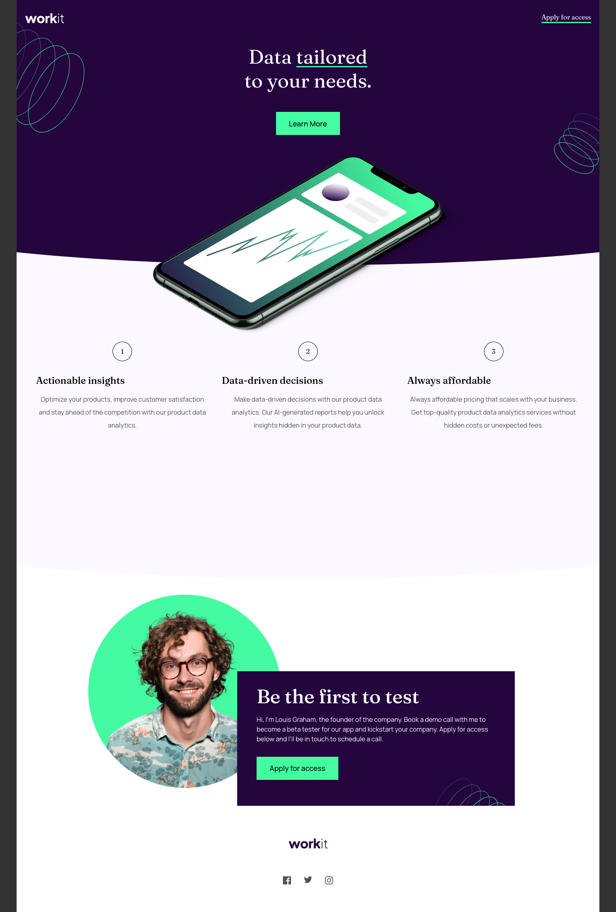

# Frontend Mentor - Workit landing page solution

# UPDATE

I have completely re-did my css. I also got rid of my buttons and made them anchor tags instead. Also added them to the social media icons as well. I added ::before and ::after which cleaned up my radius on the bottoms. Used the ::before for the numbers. Got rid of all the grid areas and mostly relied on padding and margins.

## My process

I tried my best to follow html semantics. I am not sure if I should have used article instead of section.

I took the mobile approach first and all went pretty well. It was when I started making it responsive that my strategy died. I had to then rethink realizing I didn't think it as far through as I thought. It was a true challenge but I feel alright with what I got for never doing anything this big before. I know it could be done even better and cleaner but that is what learning is.

My biggest hack I think is how I created the curves. I'm sure svg is a better route but I still need to learn how to do it that way.

### Screenshot

